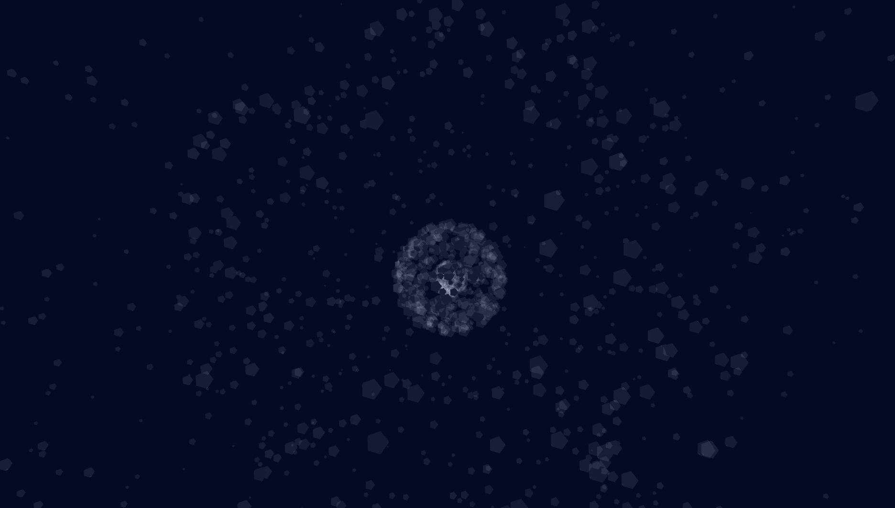
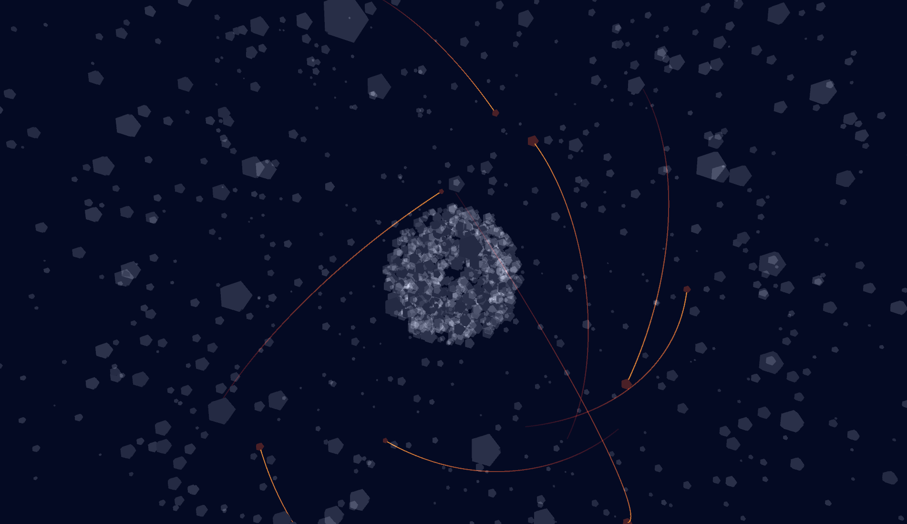
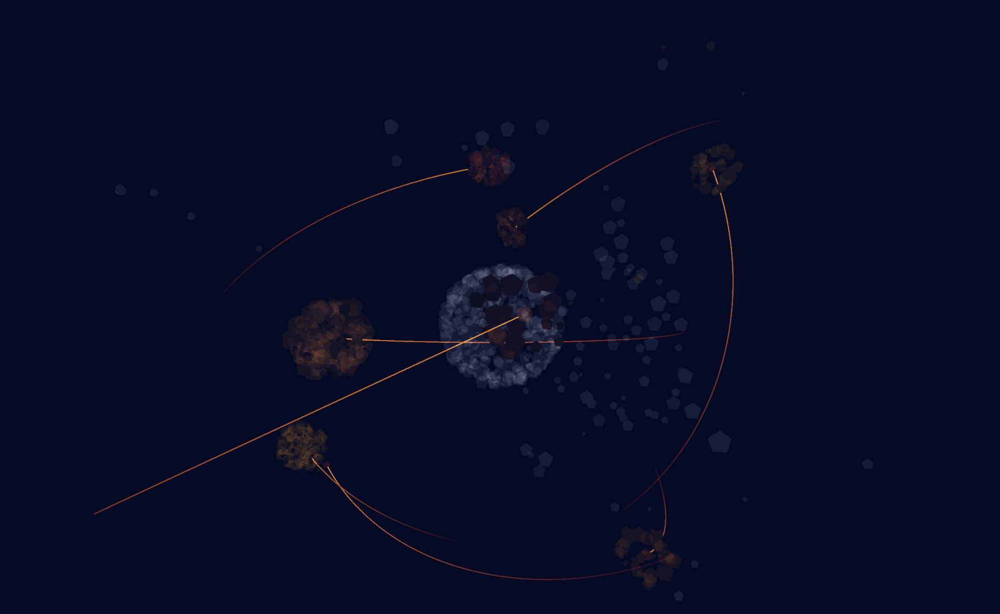
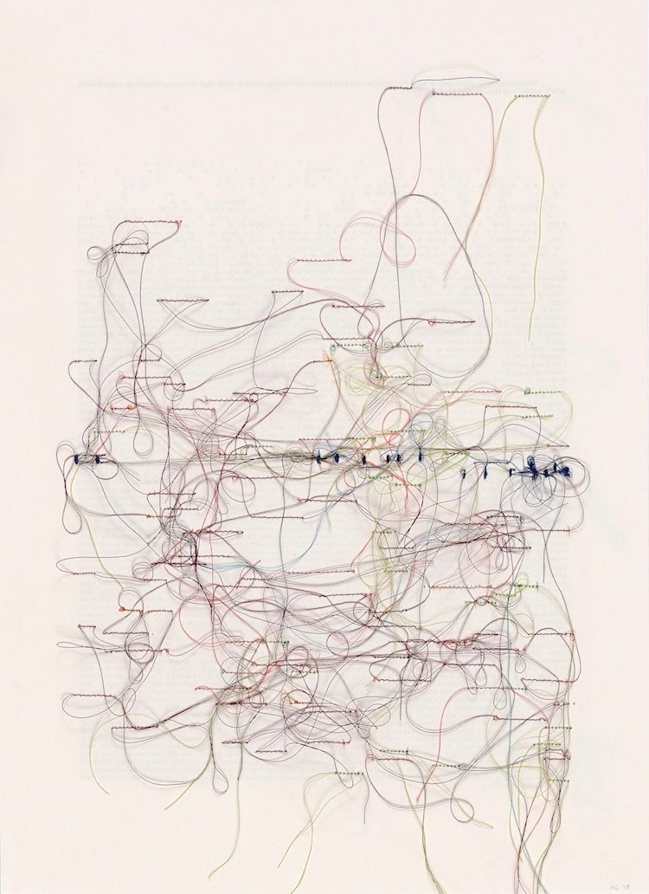
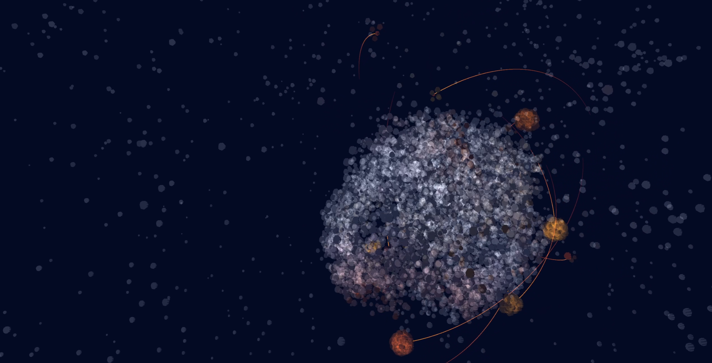
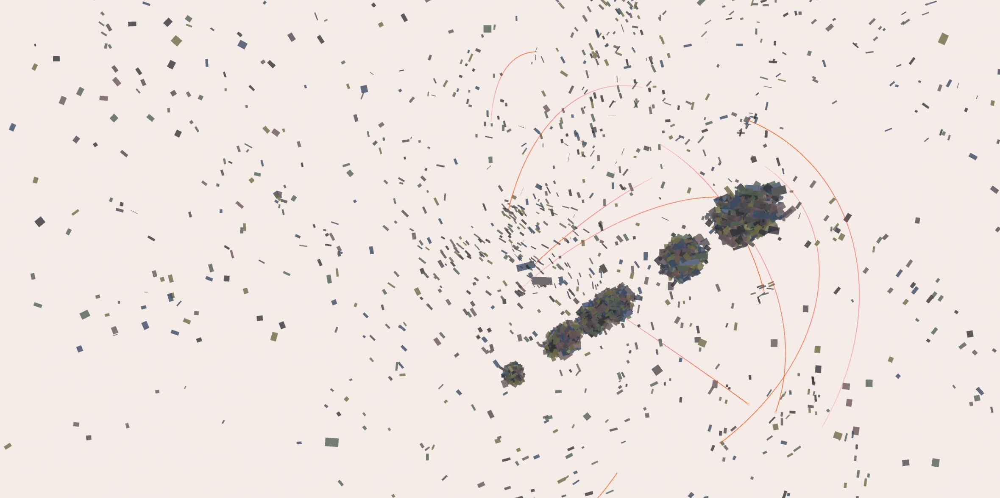
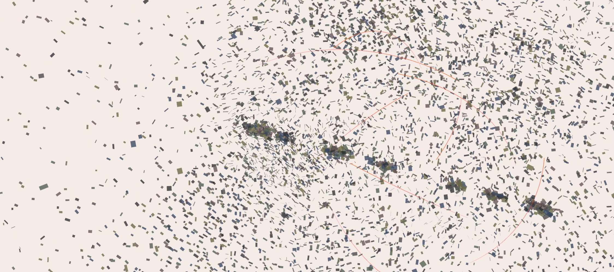

### Programación de Sistemas Dinámicos 2 (PSD2)
# Trabajo Práctico #2
Ejercicio de programación introductorio para evaluar la integración de las herramientas de IA dentro de plataformas para escribir código asistidas por IA.

> Segundo cuatrimestre, 2026 - MAE, UNTREF

<br>

# Introducción y propósito
Los sistemas generativos basados en caminantes, sistemas de partículas y campos vectoriales constituyen estrategias fundamentales del código creativo. El objetivo de este trabajo es utilizar estas técnicas como punto de partida para desarrollar una propuesta original, empleando herramientas de Inteligencia Artificial como apoyo para investigar, planificar y expandir las posibilidades del proyecto. No se espera la reproducción de los ejemplos vistos en clase, sino la construcción de un sistema con identidad propia.

<br>

## Partículas 3D

`particulas` es un sketch de Processing que genera un sistema de partículas luminosas en un espacio 3D.

Cada tanda de partículas:

1. Nace en el centro del canvas.
2. Viaja durante aproximadamente `500 ms` hasta un punto de la superficie de una esfera.
3. Permanece vibrando alrededor de esa posición durante aproximadamente `1500 ms`.
4. Se dispara radialmente hacia afuera.
5. Desaparece al superar la distancia máxima definida en el programa.

El fondo es azul oscuro y las partículas se dibujan en blanco utilizando una mezcla aditiva para producir un efecto luminoso. La cámara rota suavemente para facilitar la percepción del espacio 3D.

## Descripción del Proceso
La construcción del código fue realizada enteramente con ChatGPT (Codex) pero de forma incremental, en etapas, y realizando ajustes manualmente al final de cada etapa.

### PASO 1. Generación del sistema de partículas inicial
Lo primero que se hizo fue la creación del repositorio en GitHub y la generación del código de Processing inicial para generar un sistema de partículas que nacen del centro de la pantalla, conforman una esfera y luego estallan, es decir, las particulas salen despedidas hacia fuera de la pantalla.

El siguiente fue uno de los *prompts* iniciales para comenzar con el proyecto:

```text
Dentro del repositorio recién creado localmente vamos a iniciar un nuevo proyecto de Processing llamado particulas. Crea el archivo inicial. Me gustaría que generes un sistema de partículas, usando el espacio 3D donde las partículas partan de una posición inicial que sea una esfera en el espacio 3D centrada en el canvas. En la medida que las partículas comienzan a moverse, se alejan de la superficie de la esfera. El fondo debe ser de un azul oscuro y las particulas blancas y luminosas
```



Se ajustaron manualmente algunos parámetros de tamaño y velocidad hasta conseguir el comportamiento deseado. Luego se le pidió con el *prompt* que se muestra a continuación que fuera generando varias esferas de partículas (como explosiones):

```text
Ahora me gustaría un pequeño cambio. Las partículas se generarían desde un mismo punto (en centro del canvas por ejemplo) y demoran 500ms hasta llegar a la posición de la esfera. Luego se quedan vibrando en esa posición por aproximadamente 1500ms y luego salen disparadas radialmente hacia afuera como ahora
``` 
<br>

### PASO 2. Sistema de partículas secundario: los cometas
A continuación, se le pidió generar un segundo sistema de partículas (con únicamente 8 partículas) que representaran cometas en tonos de naranja que giren en torno a la esfera central y que dejen una estela a su camino.
El siguiente es uno de los *prompts* utilizados para realizar la tarea propuesta:

```text
Ahora quisiera que dentro del programa de processing "particulas" crees 8 partículas aparte, que no pertenezcan al sistema de partículas de la esfera. Estas partículas se verían como una especie de cometas orbitando en torno a la esfera central. Esto debe ocurrir en el espacio 3D, es decir que estos cometas deberían pasar por delante y por detrás de la esfera central de partículas. Las particulas de los 8 comentas deben ser luminosas, de color fuego.
```



También se hicieron algunos ajustes de forma manual para ajustar la velocidad de los cometas.

<br>

### PASO 3. Cometas como campos vectoriales
Luego, se le pidió que las partículas que representan a cada uno de los cometas funcionaran como una especie de campo vectorial que influenciara el desplazamiento de las partículas de la esfera. Es decir, estas partículas atraerían a las partículas emitidas por el sistema de la esfera. Para esto se redactó el siguiente *prompt*:

```text
Ahora lo que quiero hacer es que los 8 cometas (su posición y dirección) funcionen como una especie de campo vectorial. Entonces, cada una de las partículas del sistema original será atraída por el cometa que se encuentre más cercano a su trayectoria.
```



Hubo que hacer algunos ajustes manuales también en los parámetros definidos en Processing para conseguir el efecto visual deseado. También se le pidió que las partículas vayan cambiando su color en la medida que se acercan a los cometas para adquirir su color naranja.

<br>

### PASO 4. Cambio de modo de la imagen
Finalmente se decidió explorar de cambiar radicalmente la paleta de colores y el comportamiento de todas las partículas cuando el usuario mantuviera apretada la tecla "C". Esto activa un modo alternativo inspirado por la siguiente imagen descargada de Internet:


> Imagen del artista Noëlle Cup­pens  descargada de https://www.textileartist.org/wp-content/uploads/TLP.-Le-Complementaire-La-Liaison-2.jpg.webp


Las reglas que se le pidieron fueron que cuando el usuario mantuviera apretada la tecla "C" haga lo siguiente:
- El fondo transiciona gradualmente hacia el color del fondo de la imagen de referencia.
- Los cometas dejan de mostrar una estela degradada y como líneas de color rojo (como los hilos de la imagen).
- Las partículas que todavía están sobre la esfera se agrupan sobre el eje horizontal en "aglomeraciones" y vibran mediante ruido Perlin (`noise()`).
- Las partículas del sistema se dibujan como caminantes, usando una paleta de colores tomada de las líneas de la imagen.
- Al soltar la tecla **C**, el programa vuelve gradualmente al modo normal durante aproximadamente dos segundos.

El *prompt* usado fue:
```text
Dentro del repositorio cree una carpeta data con una imagen. Ahora quisiera hacer que cuando el usuario presione la tecla "C", cambien las reglas de movimiento, los colores y el dibujo de la siguiente forma. Mientras tecla C se mantenga presionada, el fondo irá cambiando gradualmente su color para adoptar el color de fondo de la imagen proporcionada. Al mismo tiempo, los cometas serán dibujados como una línea constante de color rojo (como la imagen). Las partículas que se encuentren en la superficie de la esfera se dispondrán aleatoriamente en aglomerados dispuestos en el eje central horizontal del canvas (como en la imagen) y se quedarán vibrando utilizando la función noise de ruido perlin. Por último y también mientras la tecla C se mantenga presionada, las partículas del sistema original se convertirán en caminantes tomando los colores de las líneas de la imagen proporcionada. Cuando la tecla C es liberada, todo vuelve gradualmente a su estado anterior (con una transición de un par de segundos).
```

La siguiente es una captura de la versión actualizada, mostrando las partículas en el modo convencional:



Y luego de presionar la tecla **C**, las partículas y los colores gradualmente se reacomodan para formar las siguientes composiciones (emulando la imagen de referencia):





Al igual que en las etapas anteriores, siempre hubo que hacer algunos ajustes manuales en los parámetros para modificar velocidades, tamaños y comportamientos.

<br>

## Ubicación del sketch

El proyecto se encuentra en la carpeta:

```text
particulas/
```

El archivo principal es:

```text
particulas/particulas.pde
```

Las clases están separadas en archivos individuales:

- `particula.pde`: define el comportamiento y el dibujo de cada partícula.
- `cometa.pde`: define el comportamiento y dibujo de los cometas.
- `sistemadeparticulas.pde`: administra las tandas, la actualización y la eliminación de partículas.

## Requisitos

- [Processing](https://processing.org/download) 3 o 4.
- Una computadora con soporte para el renderizador 3D de Processing.

No es necesario instalar librerías externas. El sketch utiliza únicamente funcionalidades incluidas en Processing, como `P3D`, `PVector`, `sphere()` y `blendMode()`.

## Cómo ejecutar el programa

1. Abrir Processing.
2. Seleccionar **File → Open** y abrir `particulas/particulas.pde`.
3. Pulsar el botón **Run** o utilizar **Sketch → Run**.

Processing cargará automáticamente los archivos `.pde` que forman parte de la carpeta del proyecto.
